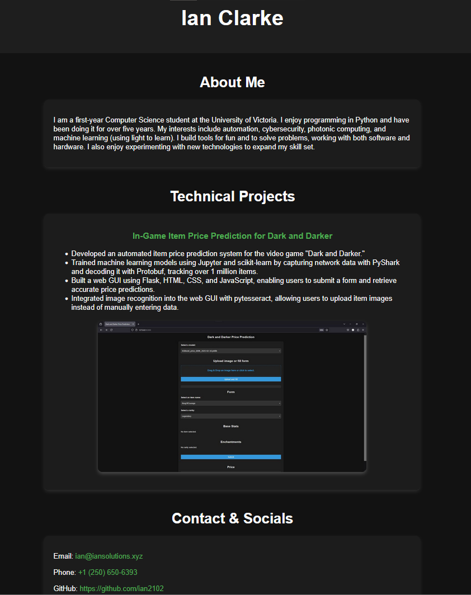

# Personal Portfolio

This portfolio is a simple web application developed using **Flask**, a lightweight Python web framework. The app features sections showcasing my skills, projects, and work.

## Features

- **Flask-powered web app**: Built with the Flask framework for a lightweight, responsive portfolio.
- **Personal projects**: Detailed sections showcasing my work, including descriptions and links to live projects and GitHub repositories.
- **Simple UI**: Minimalistic design with easy navigation.

## Technology Stack

- **Flask** - Python web framework
- **HTML/CSS** - Front-end structure and styling
- **JavaScript** - For dynamic interactions
- **Linux** - Hosting environment

## Setup Instructions

To run this portfolio locally, follow these steps:

### Prerequisites

- Python 3.x installed on your machine
- Flask and any dependencies listed in `requirements.txt`

### Installation

1. Clone the repository:

    ```bash
    git clone https://github.com/ian2102/portfolio.git
    cd portfolio
    ```

2. Create a virtual environment and activate it:

    ```bash
    python3 -m venv venv
    source venv/bin/activate  # On Windows: venv\Scripts\activate
    ```

3. Install the dependencies:

    ```bash
    pip install -r requirements.txt
    ```

4. Run the app:

    ```bash
    python app.py
    ```

5. Visit the app in your browser at `http://127.0.0.1:5000/`.

## Visit
Check out my portfolio at [Iansolutions.xyz](http://iansolutions.xyz).

A snapshot of my portfolio:


## Future Improvements

- Add a contact form for direct inquiries.
- Integrate additional features like blogs or a job board.
- Improve design and responsiveness for mobile devices.
